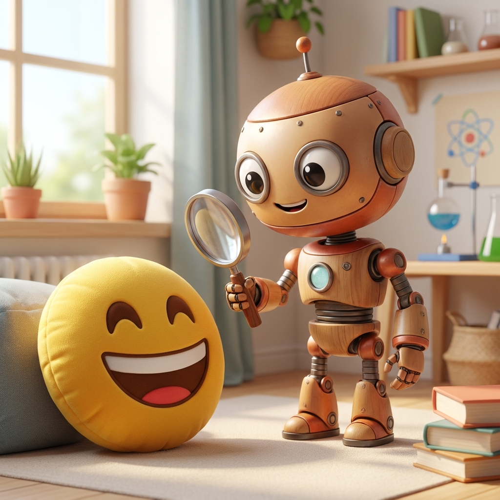
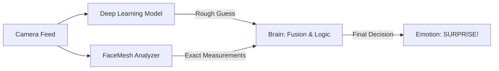

# 🤖 Understanding the Sentry AI

> **"Magic is just science that we don't understand yet."** - *Arthur C. Clarke*

Welcome to the **Under the Hood** tour! If you've ever wondered *how* Sentry actually knows you're smiling, stressed, or surprised, you're in the right place. We're going to break down the complex AI into simple, bite-sized pieces.

This guide combines our [System Architecture](ARCHITECTURE.md) and [Theoretical Foundation](THEORY.md) into one easy-to-read explanation.

---

## 🧠 The Brain: Two AIs Are Better Than One

Sentry doesn't just "look" at you; it analyzes you using a **Hybrid** approach. Imagine two experts in a room:

1.  **The Artist (Deep Learning Model):** Looks at the "vibe" or general feel of the image. "This looks like a sad face."
2.  **The Geometrician (FaceMesh):** Measures exact angles and distances. "The mouth corners are raised 5mm, and the eyes are 20% wider."

By combining these two, we get the best of both worlds!

---

## 🏗️ Architecture Simplified

For a deep dive, check out the full [System Architecture](ARCHITECTURE.md). Here is the simple version:

### 1. The Pipeline
Think of Sentry as a factory assembly line.
1.  **Camera** takes a picture (frame).
2.  **Face Detector** finds your face.
3.  **Analyzers** (Emotion & Posture) process the image.
4.  **Fusion Engine** combines the results.
5.  **Display** shows you the answer.

### 2. Deep Learning: The "Vibe" Checker (DenseNet)
The core of Sentry is a **DenseNet121** model. It breaks down your image into millions of numbers, looking for patterns like shadows around the eyes or the curve of a cheek.

*   **Input:** Your face image.
*   **Output:** Probabilities for 6 emotions (Happy, Sad, Angry, Fear, Surprise, Neutral).

### 3. FaceMesh: The Exact Measurer
To fix mistakes, we use **MediaPipe FaceMesh**. It places **468 tiny dots** on your face in 3D space.

*   **Eye Aspect Ratio (EAR):** Distance between eyelids. (Wide = Surprise/Fear).
*   **Mouth Curvature:** Corners up = Happy, Corners down = Sad.

---

## 🔬 The Science (Theory)

Our AI is based on real psychological research. For the full scientific background, read [Theory & Research](THEORY.md).

### why Multimodal?
A person may mask their emotions through facial expressions but unconsciously display stress through body language. Combining both provides a "truth serum" effect.

### Clinical Correlations
We map observable cues to mental states:

| Observable Cue | Mental Health Correlation |
|----------------|---------------------------|
| **Sadness expression** | Depression indicator |
| **Slouched posture** | Low mood, fatigue |
| **Fidgeting** | Anxiety marker |
| **Frozen stillness** | Severe stress/dissociation |

---

## 🧩 How It Comes Together: The "Surprise Formula"

How do we decide if you're surprised? We use a mathematical formula that combines both AIs:

$$ Surprise = (Wide Eyes) + (Open Mouth) + (Raised Eyebrows) $$

If the Deep Learning model says "Neutral" but your mouth is open and eyebrows are up, our logic overrides it and says "No, that's definitely **SURPRISE**!"

---

## 📡 Temporal Smoothing: The "Shock Absorbers"

A raw AI output might flick between "Happy" and "Sad" 10 times a second. That's annoying.
We use **Temporal Smoothing** (averaging over the last 0.5 seconds) to make the results stable and smooth, just like shock absorbers on a car.

---

## 🚀 Ready to Try It?

Now that you know how it works, go [Get Started](GETTING_STARTED.md) and see the AI in action!
