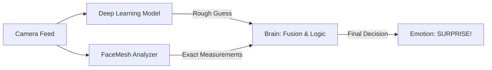

# 🤖 Understanding the Sentry AI

> **"Magic is just science that we don't understand yet."** - *Arthur C. Clarke*

Welcome to the **Under the Hood** tour! If you've ever wondered *how* Sentry actually knows you're smiling, stressed, or surprised, you're in the right place. We're going to break down the complex AI into simple, bite-sized pieces.

---

## 🧠 The Brain: Two AIs Are Better Than One

Sentry doesn't just "look" at you; it analyzes you using a **Hybrid** approach. Imagine two experts in a room:

1.  **The Artist (Deep Learning Model):** Looks at the "vibe" or general feel of the image. "This looks like a sad face."
2.  **The Geometrician (FaceMesh):** Measures exact angles and distances. "The mouth corners are raised 5mm, and the eyes are 20% wider."

By combining these two, we get the best of both worlds!

---

## 1. Deep Learning: The "Vibe" Checker

The core of Sentry is a **DenseNet121** model. Think of this as a super-powerful pattern recognition machine.

*   **How it learns:** We showed it thousands of photos of people feeling Happy, Sad, Angry, etc.
*   **How it works:** It breaks down your image into millions of numbers, looking for patterns like shadows around the eyes or the curve of a cheek.
*   **The Problem:** Sometimes it gets confused by bad lighting. A shadow might look like a frown!

---

## 2. FaceMesh: The Exact Measurer

To fix the "Vibe Checker's" mistakes, we use **MediaPipe FaceMesh**. This technology places **468 tiny dots** on your face in 3D space.

*   **Eye Aspect Ratio (EAR):** We measure the distance between your upper and lower eyelids.
    *   *Small distance?* → Eyes closed or blinking.
    *   *Huge distance?* → **Surprise!** or Fear.
*   **Mouth Curvature:** We draw a line from the center of your lip to the corners.
    *   *Corners go UP?* → **Happy** (Smile)
    *   *Corners go DOWN?* → **Sad** (Frown)

### Example: "The Surprise Formula"

How do we know you're surprised? We use math!

$$ Surprise = (Wide Eyes) + (Open Mouth) + (Raised Eyebrows) $$

If the model says "Neutral" but your mouth is open and eyebrows are up, our logic overrides it and says "No, that's definitely **SURPRISE**!"

---

## 3. Temporal Smoothing: The "Shock Absorbers"

Have you ever seen an AI flick between "Happy" and "Sad" 10 times a second? It's annoying.

To stop this, we use **Temporal Smoothing**. Think of it like the **shock absorbers** on a car.

*   **Raw Output:** Happy -> Happy -> Sad (glitch) -> Happy -> Happy
*   **Smoothed Output:** Happy -> Happy -> Happy -> Happy -> Happy

We average the predictions over the last 15 frames (about 0.5 seconds). A single "glitch" frame won't be enough to change the emotion. We also use **Hysteresis**, which means the AI is "stubborn" - it won't change its mind unless it's *really* sure the new emotion is real.

---

## 4. Posture & Body Language

Sentry isn't just a face reader; it watches your body too!

*   **Shoulder Line:** We draw a line connecting your shoulders.
    *   *Shoulders hunched up?* → Sign of **Stress** or **Fear**.
    *   *Shoulders relaxed?* → **Specific Calm**.
*   **Head Tilt:** We measure the angle of your nose line. A constant tilt might indicate fatigue or confusion.

---

## 🚀 Putting It All Together

When you sit in front of Sentry, all of this happens in **milliseconds**:

1.  **Camera** captures a frame.
2.  **Face Detector** finds your face.
3.  **DenseNet** guesses the emotion.
4.  **FaceMesh** measures your eyes and mouth.
5.  **Logic** combines them and corrects mistakes.
6.  **Smoother** stabilizes the result.
7.  **Display** shows you the final, accurate emotion.

This is how Sentry provides **Clinical-Grade Accuracy** in a real-time monitor!
