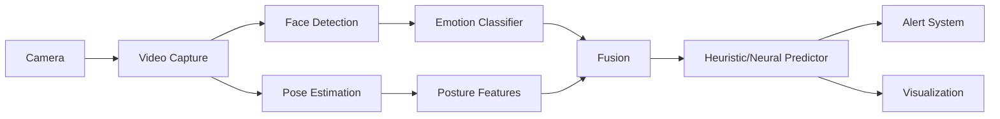

# System Architecture

Sentry is a multimodal mental health assessment framework that fuses facial and posture analysis.

## Core Pipeline

### 1. Video Acquisition
- **Capture**: 30 FPS via OpenCV
- **Buffering**: Circular buffer maintains recent history
- **Frame Management**: `src/video/`

### 2. Facial Analysis (`src/facial/`)
- **Detection**: MTCNN (Multi-task Cascaded Convolutional Networks)
- **Emotion Recognition**: MobileNetV3 (Pre-trained/Fine-tuned)
- **Action Units**: Detection of specific facial muscle movements
- **Temporal Aggregation**: Rolling window analysis of emotion stability

### 3. Posture Analysis (`src/posture/`)
- **Pose Estimation**: MediaPipe Pose (Tasks API)
- **Feature Extraction**: 
  - **Geometric**: Spine curvature, head tilt, shoulder symmetry
  - **Movement**: Fidgeting, restlessness, total kinetic energy
- **Temporal Model**: TCN (Temporal Convolutional Network) + LSTM for pattern recognition

### 4. Fusion Engine (`src/fusion/`)
- **Cross-Attention**: Bidirectional attention mechanism matches facial cues with body language
- **Feature Fusion**: Concatenates weighted features into a 1024D vector
- **Dynamic Weighting**: Assigns importance scores to each modality (e.g., if face is occluded, weight posture higher)

### 5. Prediction & Assessment (`src/prediction/`)

#### Heuristic Predictor (Default)
Uses clinical correlations to map observable cues to mental health indicators:
- **Stress**: Correlated with Anger, Fear, high movement
- **Depression**: Correlated with Sadness, slouched posture, low movement
- **Anxiety**: Correlated with Fear, Surprise, fidgeting

#### Neural Classifier (Trainable)
- Three-headed perceptron for Stress, Depression, and Anxiety
- Supports Monte Carlo Dropout for uncertainty estimation (Bayesian approximation)

## File Structure

- `main.py`: Entry point and pipeline orchestration
- `train.py`: Training and evaluation CLI
- `src/config.py`: Centralized configuration using dataclasses
- `src/utils/`: Helper utilities (model loading, math)

## Data Flow

