# Theoretical Foundation

This document provides an in-depth explanation of the research principles, machine learning architectures, and clinical correlations underlying the Sentry Mental Health Assessment Framework.

---

## Table of Contents
1. [Research Motivation](#1-research-motivation)
2. [Multimodal Emotion Recognition](#2-multimodal-emotion-recognition)
3. [Facial Expression Analysis](#3-facial-expression-analysis)
4. [Posture and Body Language Analysis](#4-posture-and-body-language-analysis)
5. [Temporal Modeling with TCN-LSTM](#5-temporal-modeling-with-tcn-lstm)
6. [Cross-Modal Fusion](#6-cross-modal-fusion)
7. [Mental Health Prediction](#7-mental-health-prediction)
8. [Clinical Correlations](#8-clinical-correlations)

---

## 1. Research Motivation

### The Problem
Mental health assessment traditionally relies on subjective self-reporting and infrequent clinical visits. This creates gaps in:
- **Early detection** of deteriorating mental states
- **Continuous monitoring** outside clinical settings
- **Objective measurement** free from patient bias

### Our Approach
Sentry uses **non-invasive behavioral cues** that are naturally observable:
- Facial expressions (micro-expressions, emotion transitions)
- Body language (posture, fidgeting, stillness)
- Temporal patterns (how behaviors change over time)

> [!TIP]
> **Why multimodal?** A person may mask their emotions through facial expressions but unconsciously display stress through body language. Combining both modalities provides more robust predictions.

---

## 2. Multimodal Emotion Recognition

### What is Multimodal Learning?

Multimodal learning combines information from multiple sensory channels (modalities) to make predictions. In mental health assessment, we use:

| Modality | Information Captured | Example Cues |
|----------|---------------------|--------------|
| **Facial** | Emotional state | Sadness, anger, fear expressions |
| **Postural** | Body language | Slouching, fidgeting, frozen stillness |
| **Temporal** | Behavioral patterns over time | Emotion stability, posture deterioration |

### Architecture Overview

```mermaid
graph TB
    subgraph Input
        Camera[📷 Camera]
    end
    
    subgraph Facial_Branch["Facial Analysis Branch"]
        MTCNN[MTCNN Detection]
        DenseNet[DenseNet121 Backbone]
        EmotionHead[Emotion Classifier]
        FacialEmbed[512D Embedding]
    end
    
    subgraph Posture_Branch["Posture Analysis Branch"]
        MediaPipe[MediaPipe Pose]
        Features[Feature Extractor]
        TCN[TCN Encoder]
        LSTM[LSTM Temporal]
        PostureEmbed[512D Embedding]
    end
    
    subgraph Fusion["Cross-Modal Fusion"]
        CrossAttn[Cross-Attention]
        Concat[Concatenation]
        FusedEmbed[1024D Fused Embedding]
    end
    
    subgraph Prediction["Mental Health Prediction"]
        SharedMLP[Shared MLP]
        StressHead[Stress Head]
        DepressionHead[Depression Head]
        AnxietyHead[Anxiety Head]
        PostureHead[Posture Head]
        TrajectoryHead[Trajectory Head]
    end
    
    Camera --> MTCNN
    Camera --> MediaPipe
    
    MTCNN --> DenseNet
    DenseNet --> EmotionHead
    DenseNet --> FacialEmbed
    
    MediaPipe --> Features
    Features --> TCN
    TCN --> LSTM
    LSTM --> PostureEmbed
    
    FacialEmbed --> CrossAttn
    PostureEmbed --> CrossAttn
    CrossAttn --> Concat
    Concat --> FusedEmbed
    
    FusedEmbed --> SharedMLP
    SharedMLP --> StressHead
    SharedMLP --> DepressionHead
    SharedMLP --> AnxietyHead
    SharedMLP --> PostureHead
    SharedMLP --> TrajectoryHead
```



---

## 3. Facial Expression Analysis

### Face Detection: MTCNN

**Multi-task Cascaded Convolutional Networks (MTCNN)** is a three-stage cascade:

1. **P-Net (Proposal Network)**: Generates candidate face regions at multiple scales
2. **R-Net (Refine Network)**: Filters false positives, refines bounding boxes
3. **O-Net (Output Network)**: Final refinement + facial landmark detection


### Emotion Classification: DenseNet121

We use **DenseNet121** as the backbone for emotion recognition. DenseNet's key innovation is **dense connectivity** — each layer receives input from ALL preceding layers.

**Why DenseNet for emotions?**
- Efficient gradient flow enables deep networks
- Feature reuse improves learning efficiency
- Works well with limited training data

**Our 6 Emotion Classes:**
| Class | Description | Clinical Relevance |
|-------|-------------|-------------------|
| Neutral | Baseline state | Reference point |
| Happy | Positive affect | Indicator of well-being |
| Sad | Depressed affect | Strong correlation with depression |
| Surprise | Unexpected events | Startle response, anxiety |
| Fear | Threat perception | Anxiety marker |
| Anger | Frustration | Stress indicator |

### Embedding Extraction

Instead of using only the classification output, we extract the **pre-classification embedding** (512 dimensions). This rich representation captures nuanced facial features for downstream fusion.

---

## 4. Posture and Body Language Analysis

### Pose Estimation: MediaPipe

MediaPipe Pose uses a **two-stage pipeline**:

1. **Detector**: Locates person in frame (runs when tracking fails)
2. **Landmark Model**: Predicts 33 body landmarks in 2D/3D

**Key Landmarks for Mental Health:**


### Feature Extraction

From raw landmark positions, we compute **15 interpretable features**:

| Category | Features | Clinical Meaning |
|----------|----------|------------------|
| **Geometric** | Spine curvature, head tilt, shoulder asymmetry | Posture quality |
| **Angular** | Arm angles, shoulder slope | Openness vs. closedness |
| **Velocity** | Movement speed, acceleration | Agitation level |
| **Derived** | Total kinetic energy, stillness duration | Overall activity |

### Posture Archetypes

Our system classifies posture into 4 archetypes:

| Archetype | Physical Markers | Psychological Association |
|-----------|-----------------|---------------------------|
| **Upright** | Straight spine, level shoulders | Confidence, alertness |
| **Slouched** | Curved spine, dropped head | Fatigue, depression |
| **Open** | Arms away from body, expanded | Comfort, confidence |
| **Closed** | Arms crossed, body contracted | Anxiety, defensiveness |

---

## 5. Temporal Modeling with TCN-LSTM

### Why Temporal Modeling?

Single-frame analysis misses crucial patterns:
- **Fidgeting**: Repetitive small movements
- **Deterioration**: Gradual posture decline over time
- **Stability**: Consistent emotional state vs. fluctuation

### TCN: Temporal Convolutional Network

TCN uses **dilated causal convolutions** to capture patterns at multiple time scales:

```mermaid
graph LR
    subgraph Dilation_1["Dilation = 1"]
        D1[●] --> D1a[●]
        D1a --> D1b[●]
    end
    
    subgraph Dilation_2["Dilation = 2"]
        D2[●] -.-> D2a[●]
        D2a -.-> D2b[●]
    end
    
    subgraph Dilation_4["Dilation = 4"]
        D4[●] -..-> D4a[●]
        D4a -..-> D4b[●]
    end
```



**Key advantages:**
- **Parallelizable**: Unlike RNNs, can process entire sequence at once
- **Variable receptive field**: Dilated convolutions see patterns at different scales
- **Causal**: Only uses past frames (important for real-time)

### LSTM: Long Short-Term Memory

After TCN, an LSTM layer captures **longer-term dependencies**:
- State transitions (e.g., calm → restless → calm)
- Trend detection (improving vs. deteriorating)

**The hybrid TCN-LSTM architecture:**

```mermaid
graph LR
    Input[Feature Sequence<br>30 frames × 15 features] --> TCN[TCN Encoder<br>Channels: 64→128→256]
    TCN --> LSTM[LSTM<br>Hidden: 128]
    LSTM --> Proj[Projection<br>512D Embedding]
```



---

## 6. Cross-Modal Fusion

### The Challenge

Facial and postural information are complementary but not redundant:
- Face might show "happy" while body shows "closed" → possibly masking
- Face might be occluded while posture is clearly visible

### Cross-Attention Mechanism

Cross-attention allows each modality to **attend to relevant parts of the other**:

```
Q = FacialEmbedding @ W_query
K = PostureEmbedding @ W_key
V = PostureEmbedding @ W_value

Attention = softmax(Q @ K.T / sqrt(d_k)) @ V
```

**Result**: Enhanced facial features that incorporate relevant postural context (and vice versa).

### Dynamic Weighting

The fusion network estimates **modality importance scores**:
- If face is occluded → weight posture higher
- If person is still → weight face higher

---

## 7. Mental Health Prediction

### Multi-Head Classification

From the 1024D fused embedding, we predict:

| Head | Classes | Description |
|------|---------|-------------|
| **Stress** | Low, Moderate, High | Acute stress level |
| **Depression** | Minimal, Mild, Moderate, Severe | Depressive indicators |
| **Anxiety** | Minimal, Mild, Moderate, Severe | Anxiety indicators |
| **Posture** | Upright, Slouched, Open, Closed | Body language state |
| **Stress Indicator** | Calm, Fidgeting, Restless, Stillness | Movement patterns |
| **Trajectory** | Stable, Deteriorating, Improving | Temporal trend |

### Uncertainty Estimation

We use **Monte Carlo Dropout** for uncertainty quantification:
1. Enable dropout at inference
2. Run prediction N times
3. Average predictions and measure variance

High variance = model is uncertain → flag for human review.

---

## 8. Clinical Correlations

### Scientific Basis

Our predictions are grounded in psychological research:

| Observable Cue | Mental Health Correlation | Research Source |
|---------------|---------------------------|-----------------|
| Sadness expression | Depression | Ekman (1992) |
| Reduced facial expressivity | Depression | Girard et al. (2014) |
| Slouched posture | Low mood, depression | Michalak et al. (2009) |
| Restlessness/fidgeting | Anxiety | DSM-5 criteria |
| Frozen stillness | Dissociation, severe anxiety | Pole (2007) |
| Fear/surprise spikes | Anxiety markers | Ekman & Friesen (1971) |

### Heuristic Predictor Logic

When neural classifier is unavailable, we use clinical heuristics:

```
Stress Score = 
    0.4 × anger_prob + 
    0.3 × fear_prob + 
    0.2 × fidgeting_level + 
    0.1 × movement_energy

Depression Score = 
    0.5 × sadness_prob + 
    0.3 × slouch_score + 
    0.1 × stillness_duration + 
    0.1 × (1 - happy_prob)

Anxiety Score = 
    0.4 × fear_prob + 
    0.2 × surprise_prob + 
    0.3 × fidgeting_level + 
    0.1 × face_touch_rate
```

---

## Class Imbalance in Emotion Recognition

### The Problem

Emotion datasets are typically imbalanced:
- **Happy**: Most common (often 50%+ of samples)
- **Sad/Neutral**: Underrepresented (5-15% each)
- **Fear/Anger**: Rare (1-5% each)

### Our Solution

1. **Oversampling**: Duplicate minority class samples
2. **Aggressive Augmentation**: Apply stronger transforms to oversampled data
3. **Class Weighting**: Higher loss weight for rare classes

```bash
# Training with balanced classes
python -m training.trainers.emotion_trainer \
    --data data/affectnet \
    --balance \
    --aggressive \
    --epochs 30
```

---

## References

1. Ekman, P. (1992). An argument for basic emotions. Cognition & Emotion.
2. Girard, J. M., et al. (2014). Nonverbal social withdrawal in depression. Psychological Medicine.
3. Michalak, J., et al. (2009). Embodiment of sadness and depression—gait patterns. Journal of Abnormal Psychology.
4. Zhang, K., et al. (2016). Joint Face Detection and Alignment using MTCNN. IEEE Signal Processing Letters.
5. Huang, G., et al. (2017). Densely Connected Convolutional Networks. CVPR.
6. Bai, S., et al. (2018). An Empirical Evaluation of Generic Convolutional and Recurrent Networks. arXiv.
