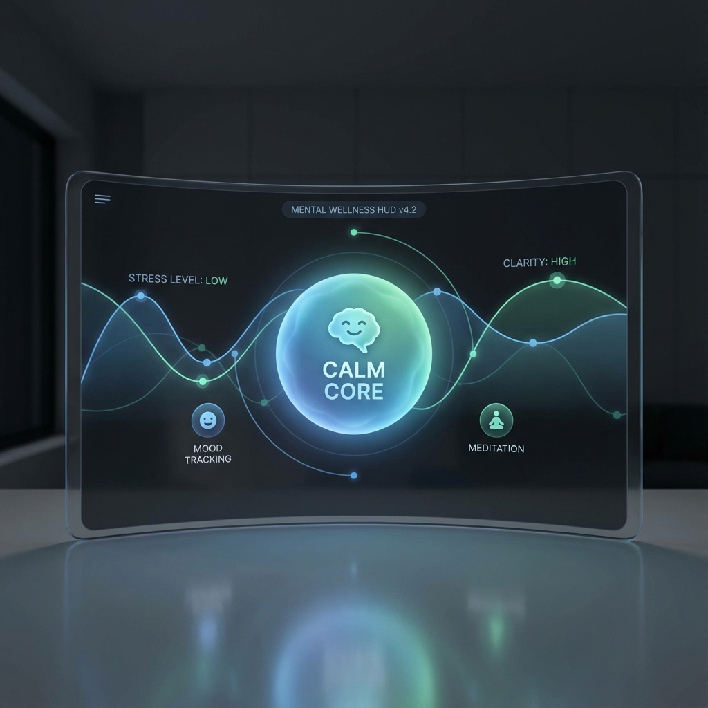

# 🩺 Sentry AI: Mental Health Monitoring Framework



> **Real-time multimodal emotion, posture, and stress analysis powered by advanced AI.**

---

## 🚀 Welcome to Sentry

Sentry is a state-of-the-art framework that uses computer vision and deep learning to assess mental well-being in real-time. By analyzing facial micro-expressions and body posture, it provides objective metrics for stress, anxiety, and emotional states.

### 🌟 Key Features

*   **Hybrid Emotion AI**: Combines Deep Learning (DenseNet) with Geometric Analysis (FaceMesh) for superior accuracy.
*   **Real-time Monitoring**: Processes video at 30+ FPS on standard hardware.
*   **Multimodal Fusion**: Integrates face and posture data for holistic assessment.
*   **Privacy First**: All processing happens locally; no video is ever sent to the cloud.

---

## 📚 Documentation & Guides

| Guide | Description |
|-------|-------------|
| [**🤖 Understand the AI**](AI_EXPLAINED.md) | **Start Here!** A fun, easy guide to how Sentry actually works inside. |
| [**🚀 Getting Started**](GETTING_STARTED.md) | Installation, setup, and running your first demo. |
| [**🏋️ Training Guide**](TRAINING.md) | How to train your own models on custom datasets. |
| [**🏗️ Architecture**](ARCHITECTURE.md) | Deep dive into the system's technical design and codebase. |
| [**💻 Commands**](COMMANDS.md) | Full reference for all CLI commands and options. |
| [**⚡ Performance**](PERFORMANCE.md) | Tips for optimizing speed and reducing latency. |
| [**📝 Changelog**](CHANGELOG.md) | History of updates, bug fixes, and new features. |

---

## 🛠️ Quick Start

```bash
# Clone the repo
git clone https://github.com/NiksheyYadav/Sentry.git

# Install dependencies
pip install -r requirements.txt

# Run the demo
python main.py --demo
```

---

<center>Made with ❤️ by the Sentry Team</center>
